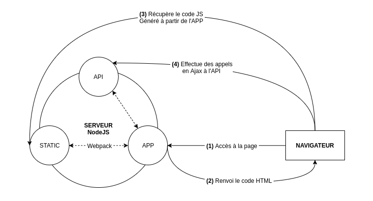

# Architecture physique

## Application Web
Application disponible via un navigateur.  
Différents types de projet sont possibles : 
- Web Serveur et Client léger
- API Serveur et Client semi-Léger
- Application Web Isomorphique

| Avantage                                     | Inconvénient
| :---                                         | :---        
| Accessible sans installation                 | Accès : Intranet / VPN / Internet
| Le "Backend" sécurisé (Accès DB / Métier)    | Un serveur et une structure réseau
| Plus léger qu'une app lourde pour le client  | Mise en place de sécurité (Login)
| Mise à jour centralisée                      |

### Web Serveur / Client léger
Le serveur doit traiter les requêtes et générer la réponse (Page Web).  
Exemple de techno : `PHP`, `ASP.Net MVC`,` Java Spring MVC`, ...

**Avantage** : 
- Le client ne doit afficher qu'une page web
- Tout le traitement est réalisé dans le serveur

**Inconvénient** : 
- Le code serveur peut devenir "volumineux"
- Nécessite une architecture puissante (CPU, RAM, Réseau, ...)
- Forte dépendance au code serveur

### API Serveur / Client semi-Léger
Le serveur traite les règles métier et renvoie les données nécessaires (XML, SOAP, JSON, ...).  
L'application client exploite les données pour générer le visuel.  
Exemple de techno : `ASP.Net API + React`, `Express API + Angular`, ...

**Avantage** : 
- Le frontend et backend sont indépendants
- La charge au niveau serveur est plus légère
- Moins de besoins pour l'infrastructure réseau

**Inconvénient** : 
- Deux technologies distinctes 
- La charge au niveau client est plus importante
- Le référencement du site n'est pas bon (de base)

### Application Web Isomorphique (Fullstack)
Variante des applications avec un frontend semi-léger (React, Angular, Vue, ...).  
Permet de solutionner les problèmes de l'architecture `API Serveur / Client semi-Léger` : 
- Meilleur référencement
- Alléger l'application client
Exemple de techno : `Next.js (React)`, `Nuxt (Vue)`, `Angular SSR`, ...  

_NB : Peut exploiter des données via une Web API ou un accès direct à la base de données._

## Application Lourde
Application installée sur la machine client.

| Avantage                | Inconvénient
| :---                    | :---        
| Pas d'accès internet    | Dépendant de la machine client (Crash / OS / Matériel)
| Pas de structure dédiée | Installation nécessaire
|                         | Peut avoir accès à la DB
|                         | Règle métier exposée côté client
